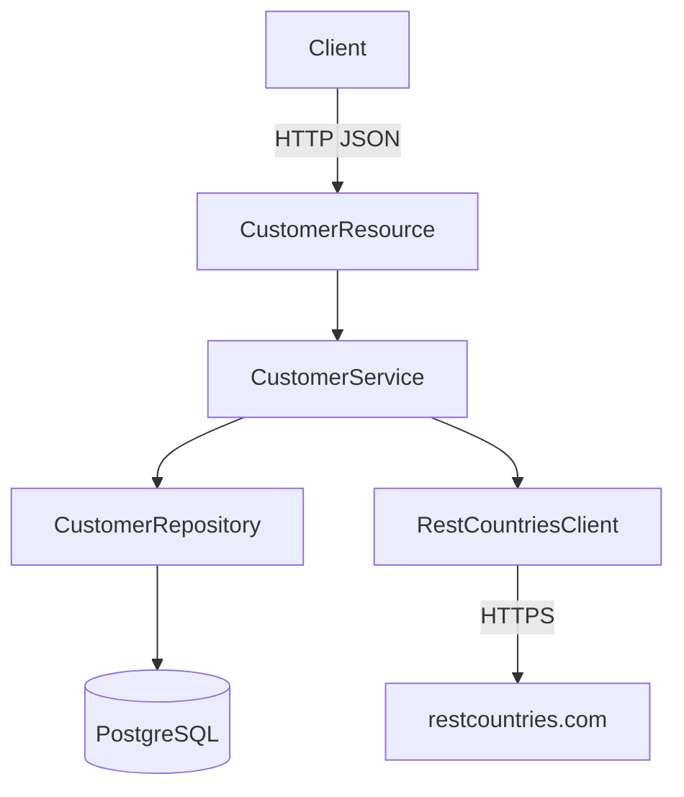
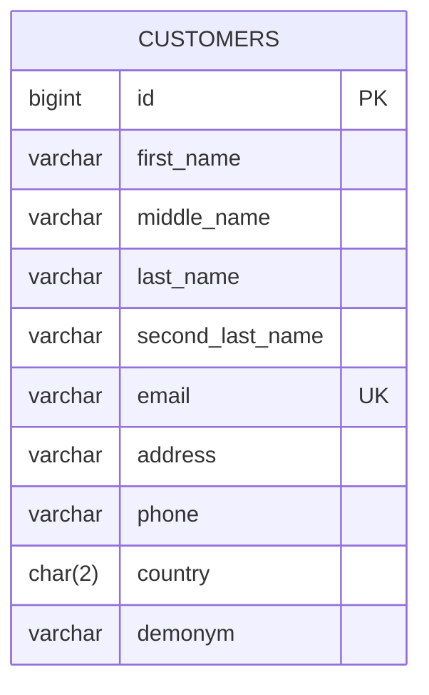
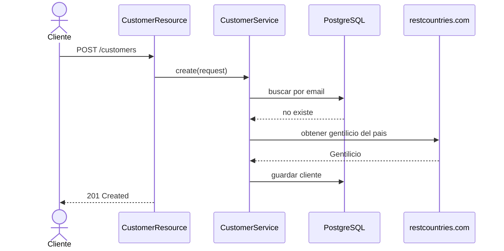
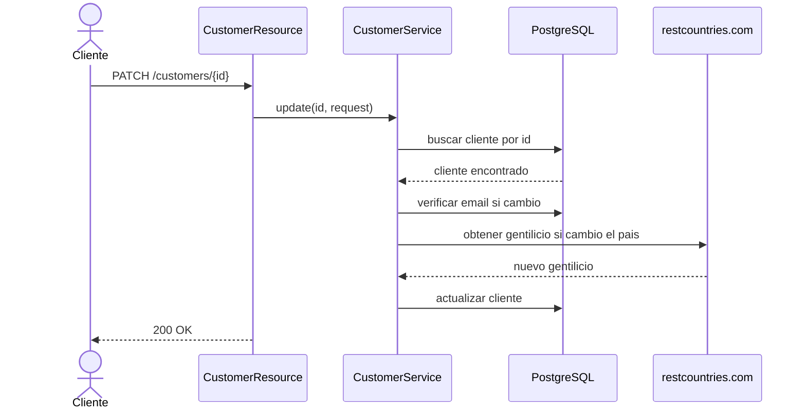
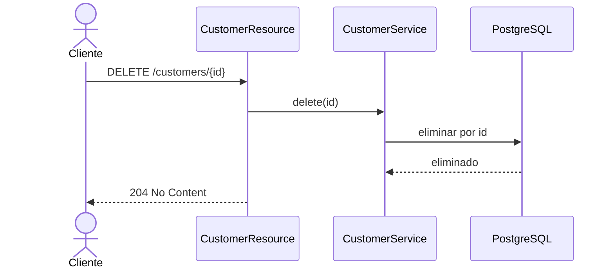

# Customer Management API

API RESTful para gestion de clientes desarrollada con Quarkus y PostgreSQL.

## Sobre los diagramas

Los diagramas de este documento estan elaborados con Mermaid y se encuentran embebidos directamente en el README. Esto lo hice para que se vea directamente en GitHub sin necesidad de abrir ninguna herramienta adicional, y se versionan junto con el codigo fuente.

---

## 1. Arquitectura general



### Capas

| Capa | Clase | Responsabilidad |
|------|-------|-----------------|
| Resource | `CustomerResource` | Expone endpoints REST, valida entrada |
| Service | `CustomerService` | Logica de negocio, orquesta repositorio y cliente externo |
| Repository | `CustomerRepository` | Acceso a datos con Panache |
| Entity | `Customer` | Mapeo ORM a tabla `customers` |
| Client | `RestCountriesClient` | Consume API externa de paises |
| Exception | `ErrorHandler` | Manejo centralizado de errores |

---

## 2. Modelo de datos



### Campos al crear (`POST /customers`)

| Campo | Tipo | Requerido | Notas |
|-------|------|-----------|-------|
| `firstName` | String | si | |
| `middleName` | String | no | |
| `lastName` | String | si | |
| `secondLastName` | String | no | |
| `email` | String | si | Formato email, unico |
| `address` | String | si | |
| `phone` | String | si | |
| `country` | String | si | Codigo ISO 3166 de 2 letras |

### Campos actualizables (`PATCH /customers/{id}`)

`email`, `address`, `phone`, `country`

Al cambiar el pais, el gentilicio (`demonym`) se actualiza automaticamente consultando https://restcountries.com.

---

## 3. Flujos principales

### Crear cliente (`POST /customers`)



### Actualizar cliente (`PATCH /customers/{id}`)



### Eliminar cliente (`DELETE /customers/{id}`)



---

## 4. Endpoints

| Metodo | URL | Descripcion |
|--------|-----|-------------|
| `POST` | `/customers` | Crear cliente |
| `GET` | `/customers` | Listar todos los clientes |
| `GET` | `/customers?country=US` | Listar clientes por pais |
| `GET` | `/customers/{id}` | Obtener cliente por ID |
| `PATCH` | `/customers/{id}` | Actualizar email, direccion, telefono y pais |
| `DELETE` | `/customers/{id}` | Eliminar cliente |

---

## 5. Configuracion

### Variables de entorno

| Variable | Default | Descripcion |
|----------|---------|-------------|
| `DB_USER` | `postgres` | Usuario de PostgreSQL |
| `DB_PASSWORD` | `postgres` | Contrasena de PostgreSQL |
| `DB_URL` | `jdbc:postgresql://localhost:5432/customerdb` | URL de conexion |

### Requisitos previos

- Java 17+
- Maven 3.9+
- Docker Desktop

---

## 6. Ejecucion

### Paso 1 — Levantar la base de datos

```bash
docker compose up -d
```

### Paso 2 — Iniciar la aplicacion

```bash
mvn quarkus:dev

# Compilar y ejecutar
mvn package
java -jar target/quarkus-app/quarkus-run.jar
```

### Paso 3 — Detener la base de datos

```bash
docker compose down

docker compose down -v
```

---

## 7. Pruebas

```bash
mvn test
```

Las pruebas unitarias usan Mockito para aislar el servicio del repositorio y del cliente externo.

---

## 8. Ejemplos de uso

### Crear cliente
```bash
curl -X POST http://localhost:8080/customers \
  -H "Content-Type: application/json" \
  -d '{
    "firstName": "Marcos",
    "lastName": "Rondon",
    "email": "Marcos@gmail.com",
    "address": "123 Main St",
    "phone": "809-123-4567",
    "country": "DO"
  }'
```

### Listar todos
```bash
curl http://localhost:8080/customers
```

### Listar por pais
```bash
curl http://localhost:8080/customers?country=US
```

### Obtener por ID
```bash
curl http://localhost:8080/customers/1
```

### Actualizar cliente
```bash
curl -X PATCH http://localhost:8080/customers/1 \
  -H "Content-Type: application/json" \
  -d '{
    "email": "new@example.com",
    "address": "123 27 de febrero",
    "phone": "809-555-9999",
    "country": "DO"
  }'
```

### Eliminar cliente
```bash
curl -X DELETE http://localhost:8080/customers/1
```

---

## 9. Decisiones de diseno

1. **Gentilicio persistido**: El gentilicio se obtiene de https://restcountries.com solo al crear o al cambiar el pais, y se almacena en la BD. Esto evita dependencia en cada lectura y mejora el rendimiento.

2. **DTO separado para actualizacion**: `CustomerUpdateRequest` solo expone los 4 campos modificables, evitando que el cliente envie campos que no deben cambiar.

3. **Validacion en dos niveles**: Bean Validation en los DTOs (formato y presencia) y validacion de negocio en el servicio (email unico, pais valido).

4. **Manejo de errores centralizado**: `ErrorHandler` convierte excepciones a respuestas HTTP consistentes en formato JSON.

5. **ISO 3166**: El codigo de pais se normaliza a mayusculas antes de persistir y consultar.

6. **Docker Compose**: La base de datos se levanta con Docker Compose para que cualquier persona pueda ejecutar el proyecto sin instalar PostgreSQL localmente.
