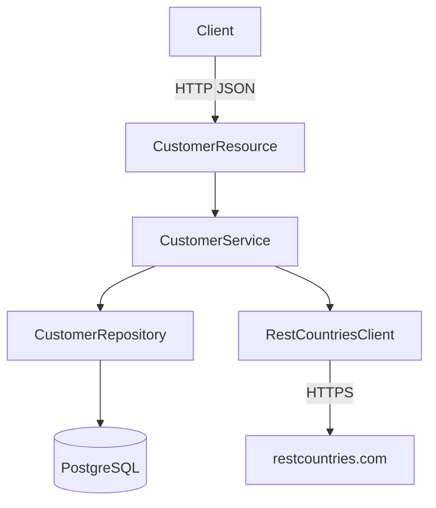

# Customer Management API

API RESTful para gestión de clientes desarrollada con **Quarkus 3.15.1** y **PostgreSQL**.

## Arquitectura



### Capas

| Capa | Clase | Responsabilidad |
|------|-------|-----------------|
| Resource | `CustomerResource` | Expone endpoints REST, valida entrada |
| Service | `CustomerService` | Lógica de negocio, orquesta repositorio y cliente externo |
| Repository | `CustomerRepository` | Acceso a datos con Panache |
| Entity | `Customer` | Mapeo ORM a tabla `customers` |
| Client | `RestCountriesClient` | Consume API externa de países |
| Exception | `ErrorHandler` | Manejo centralizado de errores |

## Endpoints

| Método | URL | Descripción |
|--------|-----|-------------|
| `POST` | `/customers` | Crear cliente |
| `GET` | `/customers` | Listar todos los clientes |
| `GET` | `/customers?country=US` | Listar clientes por país (ISO 3166) |
| `GET` | `/customers/{id}` | Obtener cliente por ID |
| `PATCH` | `/customers/{id}` | Actualizar email, dirección, teléfono y país |
| `DELETE` | `/customers/{id}` | Eliminar cliente |

## Modelo de datos

```json
{
  "id": 1,
  "firstName": "John",
  "middleName": null,
  "lastName": "Doe",
  "secondLastName": null,
  "email": "john@example.com",
  "address": "123 Main St",
  "phone": "555-1234",
  "country": "US",
  "demonym": "American"
}
```

### Campos requeridos al crear (`POST /customers`)

| Campo | Tipo | Requerido | Notas |
|-------|------|-----------|-------|
| `firstName` | String | SI | |
| `middleName` | String | NO | |
| `lastName` | String | SI | |
| `secondLastName` | String | NO | |
| `email` | String | SI | Formato email, único |
| `address` | String | SI | |
| `phone` | String | SI | |
| `country` | String | SI | Código ISO 3166 de 2 letras (ej: `US`, `CR`) |

### Campos actualizables (`PATCH /customers/{id}`)

`email`, `address`, `phone`, `country`

> Al cambiar el país, el gentilicio (`demonym`) se actualiza automáticamente consultando la API externa.

## Configuración

### Variables de entorno

| Variable | Default | Descripción |
|----------|---------|-------------|
| `DB_USER` | `postgres` | Usuario de PostgreSQL |
| `DB_PASSWORD` | `postgres` | Contraseña de PostgreSQL |
| `DB_URL` | `jdbc:postgresql://localhost:5432/customerdb` | URL de conexión |

### Requisitos previos

- Java 17+
- Maven 3.9+
- PostgreSQL 14+ corriendo en `localhost:5432`

### Crear la base de datos

```sql
CREATE DATABASE customerdb;
```

## Ejecución

```bash
# Modo desarrollo (hot reload)
mvn quarkus:dev

# Compilar y ejecutar
mvn package
java -jar target/quarkus-app/quarkus-run.jar
```

## Pruebas

```bash
mvn test
```

Las pruebas unitarias usan H2 en memoria y Mockito para aislar el servicio del repositorio y del cliente externo.

## Decisiones de diseño

1. **Demonym persistido**: El gentilicio se obtiene de la API externa solo al crear o al cambiar el país, y se almacena en la BD. Esto evita dependencia en cada lectura y mejora el rendimiento.

2. **DTO separado para actualización**: `CustomerUpdateRequest` solo expone los 4 campos modificables (RF-5), evitando que el cliente envíe campos que no deben cambiar.

3. **Validación en dos niveles**: Bean Validation en los DTOs (formato/presencia) y validación de negocio en el servicio (email único, país válido).

4. **Manejo de errores centralizado**: `ErrorHandler` convierte excepciones a respuestas HTTP consistentes en formato JSON.

5. **ISO 3166**: El código de país se normaliza a mayúsculas antes de persistir y consultar.

## Ejemplos de uso

### Crear cliente
```bash
curl -X POST http://localhost:8080/customers \
  -H "Content-Type: application/json" \
  -d '{
    "firstName": "John",
    "lastName": "Doe",
    "email": "john@example.com",
    "address": "123 Main St",
    "phone": "555-1234",
    "country": "US"
  }'
```

### Listar por país
```bash
curl http://localhost:8080/customers?country=US
```

### Actualizar cliente
```bash
curl -X PATCH http://localhost:8080/customers/1 \
  -H "Content-Type: application/json" \
  -d '{
    "email": "new@example.com",
    "address": "456 New Ave",
    "phone": "555-9999",
    "country": "CR"
  }'
```

### Eliminar cliente
```bash
curl -X DELETE http://localhost:8080/customers/1
```
